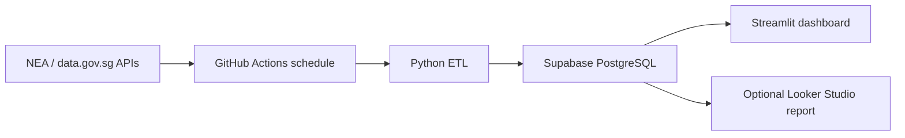

# Singapore Hourly Air Quality ETL and Dashboard Runbook

**Architecture:** GitHub Actions → Python ETL → PostgreSQL/Supabase → Streamlit or Looker Studio  
**Primary dashboard recommendation:** Streamlit  
**Refresh frequency:** Hourly at `HH:52` Singapore time  
**Source:** Singapore NEA data supplied through data.gov.sg  
**Document version:** 1.1 (source files included)  
**Last verified:** 16 September 2026

---

The files in this repository are the executable source of truth. SQL scripts are in `database/`, Python modules in `src/`, and workflow files in `.github/workflows/`. Run `001_initial_schema.sql` as a whole; run `002_optional_looker_reader.sql` only when enabling Looker Studio.

## 1. Project objective

Build a portfolio-grade data pipeline that retrieves Singapore air-quality readings every hour, retains the original API responses, normalises the observations in PostgreSQL, creates dashboard-ready analytical views, checks data quality, records pipeline health, and publishes an interactive dashboard.

The dashboard should answer:

1. What is the latest one-hour PM2.5 reading in each Singapore region?
2. Which region currently has the highest one-hour PM2.5 and 24-hour PSI?
3. Are readings increasing or decreasing compared with the previous hour?
4. How have readings changed over the last 24 hours, seven days, 30 days and 90 days?
5. When did readings enter NEA's Elevated, High, Very High, Unhealthy or worse bands?
6. Is the pipeline operating successfully, and how fresh is the latest observation?

This is an observational dashboard. It must not claim that the data proves the cause of a particular pollution reading, and it must direct users to NEA for official health advice.

---

## 2. Why hourly ingestion is appropriate

NEA publishes both one-hour PM2.5 and 24-hour PSI readings. During a developing haze event, one-hour PM2.5 is the more responsive indicator; the 24-hour PSI is a rolling measure and consequently changes more gradually.

The workflow runs at minute 52 rather than exactly on the hour because recent API responses have been published at approximately minute 45. The additional few minutes give the source time to publish the current observation and avoid GitHub Actions' busiest scheduling period at the beginning of each hour.

GitHub Actions scheduling is best-effort. A run scheduled for `11:52` may occasionally start later. This architecture is suitable for an informational portfolio dashboard, but not for a safety-critical warning service.

Official sources:

- [Hourly PM2.5 API](https://api-open.data.gov.sg/v2/real-time/api/pm25)
- [PSI and pollutant API](https://api-open.data.gov.sg/v2/real-time/api/psi)
- [Data.gov.sg API overview](https://guide.data.gov.sg/developer-guide/api-overview)
- [Data.gov.sg rate limits](https://guide.data.gov.sg/developer-guide/api-overview/api-rate-limits)
- [NEA Haze portal](https://www.haze.gov.sg/)

---

## 3. Target architecture



### Component responsibilities

| Component | Responsibility |
|---|---|
| NEA/data.gov.sg | Supplies official air-quality observations |
| GitHub Actions | Runs the ETL hourly and runs CI on code changes |
| Python | Extracts, validates, flattens and loads API data |
| Supabase PostgreSQL | Stores raw, cleaned, analytical and audit data |
| Streamlit | Provides the primary interactive dashboard |
| Looker Studio | Optional conventional BI presentation |

### Data layers

| Logical layer | PostgreSQL object | Grain |
|---|---|---|
| Bronze | `raw_api_responses` | One row per API request |
| Silver | `air_quality_readings` | One observation time × region × metric |
| Gold | Analytical views | Dashboard-ready hourly, daily and event data |
| Audit | `pipeline_runs`, `data_quality_results` | One row per run or quality result |

---

## 4. Refresh and correction strategy

Every scheduled run retrieves:

```text
PM2.5 — today
PM2.5 — yesterday
PSI   — today
PSI   — yesterday
```

This produces four API requests per hour, or 96 requests per day. Re-reading yesterday gives the pipeline a correction window for late or revised observations.

The Silver business key is:

```text
observed_at + region + metric
```

Reprocessing the same dates therefore updates existing observations rather than creating duplicates.

---

# Part A — Repository setup

## 5. Create the GitHub repository

Suggested repository name:

```text
singapore-air-quality-pipeline
```

Use this structure:

```text
singapore-air-quality-pipeline/
├── .github/
│   └── workflows/
│       ├── ci.yml
│       └── scheduled_etl.yml
├── .streamlit/
│   └── secrets.toml.example
├── app/
│   └── streamlit_app.py
├── database/
│   └── 001_initial_schema.sql
├── scripts/
│   └── run_etl.py
├── src/
│   └── air_quality/
│       ├── __init__.py
│       ├── api_client.py
│       ├── config.py
│       ├── load.py
│       ├── quality.py
│       └── transform.py
├── tests/
│   ├── fixtures/
│   │   ├── pm25_sample.json
│   │   └── psi_sample.json
│   ├── test_quality.py
│   └── test_transform.py
├── .env.example
├── .gitignore
├── pyproject.toml
├── requirements.txt
└── README.md
```

## 6. Create the local Python environment

Windows PowerShell:

```powershell
git clone https://github.com/YOUR_USERNAME/singapore-air-quality-pipeline.git
cd singapore-air-quality-pipeline

py -m venv .venv
.venv\Scripts\Activate.ps1
python -m pip install --upgrade pip
```

Bash:

```bash
git clone https://github.com/YOUR_USERNAME/singapore-air-quality-pipeline.git
cd singapore-air-quality-pipeline

python -m venv .venv
source .venv/bin/activate
python -m pip install --upgrade pip
```

## 7. Create `requirements.txt`

```text
requests>=2.32,<3
supabase>=2.18,<3
python-dotenv>=1.1,<2
pandas>=2.3,<3
streamlit>=1.49,<2
plotly>=6.3,<7
pytest>=8.4,<9
ruff>=0.13,<1
```

Install the dependencies:

```bash
pip install -r requirements.txt
```

## 8. Create `pyproject.toml`

```toml
[tool.pytest.ini_options]
pythonpath = ["src"]
testpaths = ["tests"]

[tool.ruff]
line-length = 88
target-version = "py312"

[tool.ruff.lint]
select = ["E", "F", "I", "B", "UP"]
```

## 9. Create `.gitignore`

```gitignore
.venv/
__pycache__/
.pytest_cache/
.ruff_cache/
.env
.streamlit/secrets.toml
*.pyc
.DS_Store
```

## 10. Create `.env.example`

```dotenv
SUPABASE_URL=https://YOUR_PROJECT.supabase.co
SUPABASE_SERVICE_ROLE_KEY=replace_me
SUPABASE_ANON_KEY=replace_me
DATA_GOV_API_KEY=
DAYS_BACK=1
```

Never commit `.env`, `.streamlit/secrets.toml`, a database password or the Supabase service-role key.

---

# Part B — Supabase PostgreSQL setup

## 11. Create the Supabase project

1. Create a new Supabase project.
2. Choose a region reasonably close to Singapore.
3. generate and securely retain the database password.
4. Wait for provisioning to complete.
5. Open **Project Settings → API**.
6. Copy the project URL, anonymous key and service-role key.

Use the service-role key only in the server-side ETL. Use the anonymous key in the public Streamlit application with read-only Row Level Security policies.

## 12. Create the database objects

Open the Supabase SQL Editor and save/run the following as `database/001_initial_schema.sql`.

```sql
create extension if not exists pgcrypto;

-- Bronze: one row per API response.
create table if not exists public.raw_api_responses (
    response_id uuid primary key default gen_random_uuid(),
    run_id uuid not null,
    endpoint_name text not null,
    requested_date date not null,
    fetched_at timestamptz not null default now(),
    http_status integer not null,
    response_hash text not null,
    payload jsonb not null
);

create index if not exists idx_raw_api_responses_run_id
    on public.raw_api_responses (run_id);

create index if not exists idx_raw_api_responses_requested_date
    on public.raw_api_responses (requested_date);

-- Silver: one observation time x region x metric.
create table if not exists public.air_quality_readings (
    observed_at timestamptz not null,
    published_at timestamptz not null,
    region text not null,
    metric text not null,
    value numeric not null,
    unit text not null,
    source_endpoint text not null,
    requested_date date not null,
    first_ingested_at timestamptz not null default now(),
    last_ingested_at timestamptz not null default now(),
    run_id uuid not null,

    constraint pk_air_quality_readings
        primary key (observed_at, region, metric),

    constraint chk_air_quality_region
        check (region in ('central', 'north', 'south', 'east', 'west')),

    constraint chk_air_quality_value
        check (value >= 0)
);

create index if not exists idx_air_quality_observed_at
    on public.air_quality_readings (observed_at desc);

create index if not exists idx_air_quality_metric
    on public.air_quality_readings (metric);

create index if not exists idx_air_quality_region
    on public.air_quality_readings (region);

-- Region dimension. Coordinates are representative label points.
create table if not exists public.dim_region (
    region text primary key,
    latitude numeric not null,
    longitude numeric not null,
    display_order integer not null
);

insert into public.dim_region (
    region,
    latitude,
    longitude,
    display_order
)
values
    ('central', 1.35735, 103.82, 1),
    ('north',   1.41803, 103.82, 2),
    ('south',   1.29587, 103.82, 3),
    ('east',    1.35735, 103.94, 4),
    ('west',    1.35735, 103.70, 5)
on conflict (region) do update
set
    latitude = excluded.latitude,
    longitude = excluded.longitude,
    display_order = excluded.display_order;

-- Audit tables.
create table if not exists public.pipeline_runs (
    run_id uuid primary key,
    started_at timestamptz not null,
    finished_at timestamptz,
    status text not null,
    rows_extracted integer not null default 0,
    rows_affected integer not null default 0,
    api_requests integer not null default 0,
    error_message text,
    github_run_id text,
    github_sha text,

    constraint chk_pipeline_status
        check (status in ('RUNNING', 'SUCCESS', 'FAILED'))
);

create table if not exists public.data_quality_results (
    quality_result_id bigint generated always as identity primary key,
    run_id uuid not null,
    checked_at timestamptz not null default now(),
    rule_name text not null,
    status text not null,
    actual_value text,
    expected_value text,
    details text,

    constraint chk_quality_status
        check (status in ('PASS', 'WARN', 'FAIL'))
);

create index if not exists idx_quality_results_run_id
    on public.data_quality_results (run_id);

-- Controlled idempotent upsert.
create or replace function public.upsert_air_quality_readings(
    p_rows jsonb
)
returns integer
language plpgsql
security definer
set search_path = public
as $$
declare
    affected_rows integer;
begin
    insert into public.air_quality_readings (
        observed_at,
        published_at,
        region,
        metric,
        value,
        unit,
        source_endpoint,
        requested_date,
        last_ingested_at,
        run_id
    )
    select
        x.observed_at,
        x.published_at,
        x.region,
        x.metric,
        x.value,
        x.unit,
        x.source_endpoint,
        x.requested_date,
        now(),
        x.run_id
    from jsonb_to_recordset(p_rows) as x (
        observed_at timestamptz,
        published_at timestamptz,
        region text,
        metric text,
        value numeric,
        unit text,
        source_endpoint text,
        requested_date date,
        run_id uuid
    )
    on conflict (observed_at, region, metric)
    do update set
        published_at = excluded.published_at,
        value = excluded.value,
        unit = excluded.unit,
        source_endpoint = excluded.source_endpoint,
        requested_date = excluded.requested_date,
        last_ingested_at = now(),
        run_id = excluded.run_id
    where excluded.published_at >= public.air_quality_readings.published_at;

    get diagnostics affected_rows = row_count;
    return affected_rows;
end;
$$;

revoke all on function public.upsert_air_quality_readings(jsonb)
from public, anon, authenticated;

grant execute
on function public.upsert_air_quality_readings(jsonb)
to service_role;
```

The function preserves `first_ingested_at`, applies corrections only when the incoming publication timestamp is at least as new as the stored record, and prevents duplicates.

## 13. Create Gold analytical views

Append the following SQL:

```sql
create or replace view public.v_air_quality_hourly
with (security_invoker = true)
as
select
    r.observed_at,
    timezone('Asia/Singapore', r.observed_at) as observed_at_sgt,
    timezone('Asia/Singapore', r.observed_at)::date as date_sgt,
    extract(hour from timezone('Asia/Singapore', r.observed_at))::integer
        as hour_sgt,
    r.region,
    d.latitude,
    d.longitude,

    max(r.value) filter (
        where r.metric = 'pm25_one_hourly'
    ) as pm25_1h,

    max(r.value) filter (
        where r.metric = 'pm25_twenty_four_hourly'
    ) as pm25_24h,

    max(r.value) filter (
        where r.metric = 'pm10_twenty_four_hourly'
    ) as pm10_24h,

    max(r.value) filter (
        where r.metric = 'psi_twenty_four_hourly'
    ) as psi_24h,

    max(r.value) filter (
        where r.metric = 'so2_twenty_four_hourly'
    ) as so2_24h,

    max(r.value) filter (
        where r.metric = 'co_eight_hour_max'
    ) as co_8h_max,

    max(r.value) filter (
        where r.metric = 'o3_eight_hour_max'
    ) as o3_8h_max,

    max(r.value) filter (
        where r.metric = 'no2_one_hour_max'
    ) as no2_1h_max

from public.air_quality_readings r
join public.dim_region d
    on d.region = r.region
group by
    r.observed_at,
    r.region,
    d.latitude,
    d.longitude;

create or replace view public.v_air_quality_hourly_enriched
with (security_invoker = true)
as
select
    h.*,
    case
        when h.pm25_1h is null then 'Unknown'
        when h.pm25_1h <= 55 then 'Normal'
        when h.pm25_1h <= 150 then 'Elevated'
        when h.pm25_1h <= 250 then 'High'
        else 'Very High'
    end as pm25_1h_band,
    case
        when h.psi_24h is null then 'Unknown'
        when h.psi_24h <= 50 then 'Good'
        when h.psi_24h <= 100 then 'Moderate'
        when h.psi_24h <= 200 then 'Unhealthy'
        when h.psi_24h <= 300 then 'Very Unhealthy'
        else 'Hazardous'
    end as psi_24h_category
from public.v_air_quality_hourly h;

create or replace view public.v_air_quality_hourly_change
with (security_invoker = true)
as
with previous as (
    select
        h.*,
        lag(h.observed_at) over (
            partition by h.region order by h.observed_at
        ) as previous_observed_at,
        lag(h.pm25_1h) over (
            partition by h.region order by h.observed_at
        ) as previous_pm25_1h,
        lag(h.psi_24h) over (
            partition by h.region order by h.observed_at
        ) as previous_psi_24h
    from public.v_air_quality_hourly_enriched h
)
select
    p.*,
    case when p.observed_at - p.previous_observed_at = interval '1 hour'
        then p.pm25_1h - p.previous_pm25_1h
    end as pm25_change_1h,
    case when p.observed_at - p.previous_observed_at = interval '1 hour'
        then p.psi_24h - p.previous_psi_24h
    end as psi_change_1h
from previous p;

create or replace view public.v_latest_air_quality
with (security_invoker = true)
as
select distinct on (region)
    *
from public.v_air_quality_hourly_change
order by region, observed_at desc;

create or replace view public.v_air_quality_daily_summary
with (security_invoker = true)
as
select
    date_sgt,
    region,
    min(pm25_1h) as min_pm25_1h,
    avg(pm25_1h) as avg_pm25_1h,
    max(pm25_1h) as max_pm25_1h,
    min(psi_24h) as min_psi_24h,
    avg(psi_24h) as avg_psi_24h,
    max(psi_24h) as max_psi_24h,
    count(pm25_1h) as pm25_observation_count
from public.v_air_quality_hourly
group by date_sgt, region;

create or replace view public.v_haze_events
with (security_invoker = true)
as
select
    observed_at,
    observed_at_sgt,
    region,
    pm25_1h,
    pm25_1h_band,
    pm25_change_1h,
    psi_24h,
    psi_24h_category,
    case
        when pm25_1h >= 251 then 'CRITICAL'
        when pm25_1h >= 151 then 'HIGH'
        when pm25_1h >= 56 then 'ELEVATED'
        when psi_24h > 100 then 'UNHEALTHY_PSI'
        else 'NORMAL'
    end as event_level
from public.v_air_quality_hourly_change
where pm25_1h >= 56 or psi_24h > 100;

create or replace view public.v_pipeline_freshness
with (security_invoker = true)
as
select
    max(observed_at) as latest_observation_utc,
    timezone('Asia/Singapore', max(observed_at))
        as latest_observation_sgt,
    max(last_ingested_at) as latest_ingestion_utc,
    extract(epoch from (now() - max(observed_at))) / 3600.0
        as observation_age_hours,
    case
        when extract(epoch from (now() - max(observed_at))) / 3600.0 <= 2
            then 'FRESH'
        when extract(epoch from (now() - max(observed_at))) / 3600.0 <= 3
            then 'DELAYED'
        else 'STALE'
    end as freshness_status
from public.air_quality_readings;

-- Sanitised public run information: no raw error message or commit SHA.
-- This deliberately uses the view owner's privileges so anon users never
-- receive direct permission on the underlying audit table.
create or replace view public.v_pipeline_status
as
select
    run_id,
    started_at,
    finished_at,
    status,
    rows_extracted,
    rows_affected,
    api_requests
from public.pipeline_runs;
```

The official NEA one-hour PM2.5 bands used above are:

| One-hour PM2.5 | Descriptor |
|---:|---|
| 0–55 µg/m³ | Normal |
| 56–150 µg/m³ | Elevated |
| 151–250 µg/m³ | High |
| 251 µg/m³ and above | Very High |

The 24-hour PSI categories are:

| PSI | Descriptor |
|---:|---|
| 0–50 | Good |
| 51–100 | Moderate |
| 101–200 | Unhealthy |
| 201–300 | Very Unhealthy |
| Above 300 | Hazardous |

## 14. Configure Row Level Security

Append:

```sql
alter table public.raw_api_responses enable row level security;
alter table public.air_quality_readings enable row level security;
alter table public.pipeline_runs enable row level security;
alter table public.data_quality_results enable row level security;
alter table public.dim_region enable row level security;

create policy "Public may read air-quality readings"
on public.air_quality_readings
for select
to anon
using (true);

create policy "Public may read region dimension"
on public.dim_region
for select
to anon
using (true);

-- The public can read the sanitised view, but not pipeline_runs directly.
grant select on public.air_quality_readings to anon;
grant select on public.dim_region to anon;
grant select on public.v_air_quality_hourly to anon;
grant select on public.v_air_quality_hourly_enriched to anon;
grant select on public.v_air_quality_hourly_change to anon;
grant select on public.v_latest_air_quality to anon;
grant select on public.v_air_quality_daily_summary to anon;
grant select on public.v_haze_events to anon;
grant select on public.v_pipeline_freshness to anon;
grant select on public.v_pipeline_status to anon;

revoke all on public.pipeline_runs from anon;
```

`v_pipeline_status` intentionally exposes only non-sensitive run fields through the view owner's privileges. Anonymous users receive access to that view but no direct access to `pipeline_runs`, so raw error messages and commit information remain private.

Do not create anonymous policies for `raw_api_responses` or `data_quality_results`.

---

# Part C — Python ETL

## 15. Create the configuration module

`src/air_quality/config.py`:

```python
import os

from dotenv import load_dotenv

load_dotenv()

SUPABASE_URL = os.getenv("SUPABASE_URL", "")
SUPABASE_SERVICE_ROLE_KEY = os.getenv("SUPABASE_SERVICE_ROLE_KEY", "")

DATA_GOV_API_KEY = os.getenv("DATA_GOV_API_KEY") or None
DAYS_BACK = int(os.getenv("DAYS_BACK", "1"))

PM25_URL = "https://api-open.data.gov.sg/v2/real-time/api/pm25"
PSI_URL = "https://api-open.data.gov.sg/v2/real-time/api/psi"

VALID_REGIONS = {"central", "north", "south", "east", "west"}
```

## 16. Create the API client

`src/air_quality/api_client.py`:

```python
import time
from typing import Any

import requests


class DataGovClient:
    def __init__(self, api_key: str | None = None) -> None:
        self.session = requests.Session()
        self.session.headers.update(
            {
                "Accept": "application/json",
                "User-Agent": "sg-air-quality-portfolio/1.0",
            }
        )

        if api_key:
            self.session.headers["x-api-key"] = api_key

    def get_readings(
        self,
        url: str,
        requested_date: str,
        attempts: int = 3,
    ) -> tuple[dict[str, Any], int]:
        last_error: Exception | None = None

        for attempt in range(1, attempts + 1):
            try:
                response = self.session.get(
                    url,
                    params={"date": requested_date},
                    timeout=30,
                )

                if response.status_code == 429:
                    time.sleep(2**attempt)
                    continue

                response.raise_for_status()
                payload = response.json()

                if payload.get("code") != 0:
                    raise RuntimeError(
                        "API returned an unsuccessful code: "
                        f"{payload.get('code')}; {payload.get('errorMsg')}"
                    )

                data = payload.get("data")
                if not isinstance(data, dict) or "items" not in data:
                    raise RuntimeError("API response is missing data.items")

                return payload, response.status_code

            except (requests.RequestException, ValueError, RuntimeError) as exc:
                last_error = exc
                if attempt < attempts:
                    time.sleep(2**attempt)

        raise RuntimeError(
            f"API request failed after {attempts} attempts"
        ) from last_error
```

## 17. Create the transformation module

`src/air_quality/transform.py`:

```python
from typing import Any

UNIT_BY_METRIC = {
    "pm25_one_hourly": "µg/m³",
    "pm25_twenty_four_hourly": "µg/m³",
    "pm10_twenty_four_hourly": "µg/m³",
    "psi_twenty_four_hourly": "index",
    "so2_twenty_four_hourly": "µg/m³",
    "co_eight_hour_max": "mg/m³",
    "o3_eight_hour_max": "µg/m³",
    "no2_one_hour_max": "µg/m³",
    "co_sub_index": "index",
    "o3_sub_index": "index",
    "pm10_sub_index": "index",
    "pm25_sub_index": "index",
    "so2_sub_index": "index",
}


def flatten_payload(
    payload: dict[str, Any],
    endpoint_name: str,
    requested_date: str,
    run_id: str,
) -> list[dict[str, Any]]:
    rows: list[dict[str, Any]] = []
    items = payload.get("data", {}).get("items", [])

    for item in items:
        observed_at = item["timestamp"]
        published_at = item["updatedTimestamp"]
        readings = item.get("readings", {})

        for metric, regional_values in readings.items():
            unit = UNIT_BY_METRIC.get(metric, "unknown")

            for region, value in regional_values.items():
                rows.append(
                    {
                        "observed_at": observed_at,
                        "published_at": published_at,
                        "region": region,
                        "metric": metric,
                        "value": value,
                        "unit": unit,
                        "source_endpoint": endpoint_name,
                        "requested_date": requested_date,
                        "run_id": run_id,
                    }
                )

    return rows
```

## 18. Create the data-quality module

`src/air_quality/quality.py`:

```python
from collections import Counter
from datetime import UTC, datetime
from typing import Any

VALID_REGIONS = {"central", "north", "south", "east", "west"}


def make_result(
    run_id: str,
    rule_name: str,
    status: str,
    actual_value: str,
    expected_value: str,
    details: str,
) -> dict[str, str]:
    return {
        "run_id": run_id,
        "checked_at": datetime.now(UTC).isoformat(),
        "rule_name": rule_name,
        "status": status,
        "actual_value": actual_value,
        "expected_value": expected_value,
        "details": details,
    }


def run_quality_checks(
    rows: list[dict[str, Any]],
    run_id: str,
) -> list[dict[str, str]]:
    results: list[dict[str, str]] = []

    regions = {row["region"] for row in rows}
    results.append(
        make_result(
            run_id,
            "valid_regions",
            "PASS" if regions.issubset(VALID_REGIONS) else "FAIL",
            ",".join(sorted(regions)),
            ",".join(sorted(VALID_REGIONS)),
            "Every region must be recognised.",
        )
    )

    bad_timestamps = 0
    for row in rows:
        try:
            observed_at = datetime.fromisoformat(row["observed_at"])
            published_at = datetime.fromisoformat(row["published_at"])
            if observed_at.tzinfo is None or published_at.tzinfo is None:
                bad_timestamps += 1
        except (KeyError, TypeError, ValueError):
            bad_timestamps += 1
    results.append(
        make_result(
            run_id,
            "timezone_aware_timestamps",
            "PASS" if bad_timestamps == 0 else "FAIL",
            str(bad_timestamps),
            "0",
            "Observation and publication timestamps must have UTC offsets.",
        )
    )

    negative_count = sum(row["value"] < 0 for row in rows)
    results.append(
        make_result(
            run_id,
            "non_negative_values",
            "PASS" if negative_count == 0 else "FAIL",
            str(negative_count),
            "0",
            "Measurements must not be negative.",
        )
    )

    keys = [
        (row["observed_at"], row["region"], row["metric"])
        for row in rows
    ]
    duplicate_count = len(keys) - len(set(keys))
    results.append(
        make_result(
            run_id,
            "batch_uniqueness",
            "PASS" if duplicate_count == 0 else "FAIL",
            str(duplicate_count),
            "0",
            "No duplicate timestamp-region-metric keys are allowed.",
        )
    )

    results.append(
        make_result(
            run_id,
            "non_empty_batch",
            "PASS" if rows else "FAIL",
            str(len(rows)),
            "> 0",
            "The extracted batch must contain records.",
        )
    )

    pm25_counts = Counter(
        row["observed_at"]
        for row in rows
        if row["metric"] == "pm25_one_hourly"
    )
    incomplete_hours = sum(count < 5 for count in pm25_counts.values())
    results.append(
        make_result(
            run_id,
            "pm25_regional_completeness",
            "PASS" if pm25_counts and incomplete_hours == 0 else "WARN",
            str(incomplete_hours),
            "0 incomplete hours",
            "Each PM2.5 observation normally contains five regions.",
        )
    )

    return results
```

A missing region produces `WARN`, not `FAIL`, because an official real-time feed may temporarily publish incomplete data. Structural failures and invalid values still stop the load.

## 19. Create the loader

`src/air_quality/load.py`:

```python
from typing import Any

from supabase import Client


def save_raw_response(client: Client, record: dict[str, Any]) -> None:
    client.table("raw_api_responses").insert(record).execute()


def upsert_readings(client: Client, rows: list[dict[str, Any]]) -> int:
    if not rows:
        return 0

    affected = 0
    # Small HTTP batches make backfills resilient to request-size limits.
    for offset in range(0, len(rows), 250):
        response = client.rpc(
            "upsert_air_quality_readings",
            {"p_rows": rows[offset : offset + 250]},
        ).execute()
        affected += int(response.data or 0)
    return affected


def save_quality_results(
    client: Client,
    results: list[dict[str, Any]],
) -> None:
    if results:
        client.table("data_quality_results").insert(results).execute()
```

## 20. Create the orchestration script

`scripts/run_etl.py`:

```python
# ruff: noqa: E402, I001
import hashlib
import json
import os
import sys
import time
import uuid
from datetime import datetime, timedelta, UTC
from pathlib import Path
from zoneinfo import ZoneInfo

PROJECT_ROOT = Path(__file__).resolve().parents[1]
sys.path.insert(0, str(PROJECT_ROOT / "src"))

from supabase import create_client  # noqa: E402

from air_quality.api_client import DataGovClient  # noqa: E402
from air_quality.config import (
    DATA_GOV_API_KEY,
    DAYS_BACK,
    PM25_URL,
    PSI_URL,
    SUPABASE_SERVICE_ROLE_KEY,
    SUPABASE_URL,
)
from air_quality.load import (  # noqa: E402
    save_quality_results,
    save_raw_response,
    upsert_readings,
)
from air_quality.quality import run_quality_checks  # noqa: E402
from air_quality.transform import flatten_payload  # noqa: E402

SGT = ZoneInfo("Asia/Singapore")


def canonical_hash(payload: dict) -> str:
    encoded = json.dumps(
        payload,
        sort_keys=True,
        separators=(",", ":"),
    ).encode("utf-8")
    return hashlib.sha256(encoded).hexdigest()


def requested_dates(days_back: int) -> list[str]:
    today_sgt = datetime.now(SGT).date()
    return [
        (today_sgt - timedelta(days=offset)).isoformat()
        for offset in range(days_back + 1)
    ]


def main() -> None:
    if not SUPABASE_URL or not SUPABASE_SERVICE_ROLE_KEY:
        raise RuntimeError("Set SUPABASE_URL and SUPABASE_SERVICE_ROLE_KEY")
    if not 0 <= DAYS_BACK <= 89:
        raise ValueError("DAYS_BACK must be between 0 and 89")

    run_id = str(uuid.uuid4())
    started_at = datetime.now(UTC).isoformat()

    supabase = create_client(SUPABASE_URL, SUPABASE_SERVICE_ROLE_KEY)
    supabase.table("pipeline_runs").insert(
        {
            "run_id": run_id,
            "started_at": started_at,
            "status": "RUNNING",
            "github_run_id": os.getenv("GITHUB_RUN_ID"),
            "github_sha": os.getenv("GITHUB_SHA"),
        }
    ).execute()

    api_client = DataGovClient(DATA_GOV_API_KEY)
    endpoints = [("pm25", PM25_URL), ("psi", PSI_URL)]

    extracted_count = 0
    request_count = 0
    affected_count = 0

    try:
        for requested_date in requested_dates(DAYS_BACK):
            day_rows: list[dict] = []
            for endpoint_name, url in endpoints:
                payload, status_code = api_client.get_readings(
                    url=url,
                    requested_date=requested_date,
                )
                request_count += 1

                save_raw_response(
                    supabase,
                    {
                        "run_id": run_id,
                        "endpoint_name": endpoint_name,
                        "requested_date": requested_date,
                        "fetched_at": datetime.now(UTC).isoformat(),
                        "http_status": status_code,
                        "response_hash": canonical_hash(payload),
                        "payload": payload,
                    },
                )

                day_rows.extend(
                    flatten_payload(
                        payload=payload,
                        endpoint_name=endpoint_name,
                        requested_date=requested_date,
                        run_id=run_id,
                    )
                )

                if DAYS_BACK > 1:
                    time.sleep(2)

            extracted_count += len(day_rows)
            quality_results = run_quality_checks(day_rows, run_id)
            save_quality_results(supabase, quality_results)

            failed_rules = [
                result["rule_name"]
                for result in quality_results
                if result["status"] == "FAIL"
            ]
            if failed_rules:
                raise RuntimeError(
                    f"Quality checks failed on {requested_date}: {failed_rules}"
                )

            affected_count += upsert_readings(supabase, day_rows)

        supabase.table("pipeline_runs").update(
            {
                "finished_at": datetime.now(UTC).isoformat(),
                "status": "SUCCESS",
                "rows_extracted": extracted_count,
                "rows_affected": affected_count,
                "api_requests": request_count,
            }
        ).eq("run_id", run_id).execute()

        print(
            f"ETL succeeded: extracted={extracted_count}, "
            f"affected={affected_count}"
        )

    except Exception as exc:
        supabase.table("pipeline_runs").update(
            {
                "finished_at": datetime.now(UTC).isoformat(),
                "status": "FAILED",
                "rows_extracted": extracted_count,
                "rows_affected": affected_count,
                "api_requests": request_count,
                "error_message": str(exc)[:2000],
            }
        ).eq("run_id", run_id).execute()
        raise


if __name__ == "__main__":
    main()
```

---

# Part D — Local validation

## 21. Create the local `.env`

```dotenv
SUPABASE_URL=https://YOUR_PROJECT.supabase.co
SUPABASE_SERVICE_ROLE_KEY=YOUR_SERVICE_ROLE_KEY
DATA_GOV_API_KEY=
DAYS_BACK=1
```

Run:

```bash
python scripts/run_etl.py
```

## 22. Inspect the load

Run in Supabase SQL Editor:

```sql
select count(*) from public.raw_api_responses;
select count(*) from public.air_quality_readings;

select *
from public.v_latest_air_quality
order by region;

select *
from public.v_pipeline_freshness;

select *
from public.pipeline_runs
order by started_at desc
limit 10;
```

## 23. Verify idempotency

Run the ETL again, then execute:

```sql
select
    observed_at,
    region,
    metric,
    count(*)
from public.air_quality_readings
group by observed_at, region, metric
having count(*) > 1;
```

Expected result: zero rows.

---

# Part E — Automated tests and CI

## 24. Save deterministic API fixtures

Save a representative response from each API as:

```text
tests/fixtures/pm25_sample.json
tests/fixtures/psi_sample.json
```

Do not call the live API during every pull-request test. Fixtures make the tests repeatable and prevent external downtime from blocking code review.

## 25. Create transformation tests

`tests/test_transform.py`:

```python
import json
from pathlib import Path

from air_quality.transform import flatten_payload

FIXTURE_DIR = Path(__file__).parent / "fixtures"


def load_fixture(name: str) -> dict:
    with (FIXTURE_DIR / name).open(encoding="utf-8") as file:
        return json.load(file)


def test_pm25_fixture_is_flattened() -> None:
    rows = flatten_payload(
        payload=load_fixture("pm25_sample.json"),
        endpoint_name="pm25",
        requested_date="2026-09-16",
        run_id="00000000-0000-0000-0000-000000000001",
    )

    assert rows
    assert all(row["metric"] == "pm25_one_hourly" for row in rows)
    assert {row["region"] for row in rows} == {
        "central",
        "north",
        "south",
        "east",
        "west",
    }


def test_psi_fixture_contains_expected_metrics() -> None:
    rows = flatten_payload(
        payload=load_fixture("psi_sample.json"),
        endpoint_name="psi",
        requested_date="2026-09-16",
        run_id="00000000-0000-0000-0000-000000000001",
    )

    metrics = {row["metric"] for row in rows}
    assert "psi_twenty_four_hourly" in metrics
    assert "pm25_twenty_four_hourly" in metrics
    assert "pm10_twenty_four_hourly" in metrics
```

## 26. Create a quality test

`tests/test_quality.py`:

```python
from air_quality.quality import run_quality_checks


def sample_row(region: str = "central") -> dict:
    return {
        "observed_at": "2026-09-16T11:00:00+08:00",
        "published_at": "2026-09-16T11:45:45+08:00",
        "region": region,
        "metric": "pm25_one_hourly",
        "value": 26,
    }


def test_negative_values_fail_quality_check() -> None:
    row = sample_row()
    row["value"] = -1
    rows = [row]

    results = run_quality_checks(
        rows,
        "00000000-0000-0000-0000-000000000001",
    )
    result_by_name = {result["rule_name"]: result for result in results}

    assert result_by_name["non_negative_values"]["status"] == "FAIL"


def test_partial_region_is_warning_and_duplicates_fail() -> None:
    row = sample_row()
    results = run_quality_checks([row], "test-run")
    by_rule = {result["rule_name"]: result for result in results}
    assert by_rule["pm25_regional_completeness"]["status"] == "WARN"

    results = run_quality_checks([row, row.copy()], "test-run")
    by_rule = {result["rule_name"]: result for result in results}
    assert by_rule["batch_uniqueness"]["status"] == "FAIL"


def test_naive_timestamp_fails() -> None:
    row = sample_row()
    row["observed_at"] = "2026-09-16T11:00:00"
    results = run_quality_checks([row], "test-run")
    by_rule = {result["rule_name"]: result for result in results}
    assert by_rule["timezone_aware_timestamps"]["status"] == "FAIL"
```

Run locally:

```bash
pytest -q
ruff check .
```

## 27. Create `.github/workflows/ci.yml`

```yaml
name: CI

on:
  push:
    branches: [main]
  pull_request:
    branches: [main]

jobs:
  test:
    runs-on: ubuntu-latest

    steps:
      - name: Check out repository
        uses: actions/checkout@v4

      - name: Set up Python
        uses: actions/setup-python@v5
        with:
          python-version: "3.12"
          cache: pip

      - name: Install dependencies
        run: pip install -r requirements.txt

      - name: Run linting
        run: ruff check .

      - name: Run tests
        run: pytest -q
```

---

# Part F — Hourly GitHub Actions orchestration

## 28. Add GitHub repository secrets

Open:

```text
Repository → Settings → Secrets and variables → Actions
```

Create:

```text
SUPABASE_URL
SUPABASE_SERVICE_ROLE_KEY
DATA_GOV_API_KEY
```

The data.gov.sg key is optional for this request volume but recommended for a production-style workflow.

## 29. Create `.github/workflows/scheduled_etl.yml`

```yaml
name: Scheduled air-quality ETL

on:
  schedule:
    - cron: "52 * * * *"
      timezone: "Asia/Singapore"

  workflow_dispatch:
    inputs:
      days_back:
        description: "Previous days to include; 1 means today and yesterday"
        required: false
        default: "1"

concurrency:
  group: singapore-air-quality-etl
  cancel-in-progress: false

jobs:
  run-etl:
    runs-on: ubuntu-latest
    timeout-minutes: 25

    steps:
      - name: Check out repository
        uses: actions/checkout@v4

      - name: Set up Python
        uses: actions/setup-python@v5
        with:
          python-version: "3.12"
          cache: pip

      - name: Install dependencies
        run: pip install -r requirements.txt

      - name: Run ETL
        env:
          SUPABASE_URL: ${{ secrets.SUPABASE_URL }}
          SUPABASE_SERVICE_ROLE_KEY: ${{ secrets.SUPABASE_SERVICE_ROLE_KEY }}
          DATA_GOV_API_KEY: ${{ secrets.DATA_GOV_API_KEY }}
          DAYS_BACK: ${{ inputs.days_back || '1' }}
        run: python scripts/run_etl.py
```

The concurrency group prevents two ETL executions from running simultaneously. `cancel-in-progress: false` preserves a delayed run rather than cancelling it when the next schedule fires.

## 30. Test the workflow manually

1. Open the repository's **Actions** tab.
2. Select **Scheduled air-quality ETL**.
3. Choose **Run workflow**.
4. Leave `days_back` as `1`.
5. Confirm that the workflow succeeds.
6. Inspect `pipeline_runs`, `data_quality_results` and the Gold views.

Do not enable reliance on the schedule until a manual run succeeds.

---

# Part G — Historical backfill

## 31. Run a seven-day trial backfill

Manually run the workflow with:

```text
days_back: 6
```

Because today is included, this retrieves seven calendar dates.

Validate:

- Raw responses were stored.
- Silver contains no duplicate business keys.
- All five regions normally appear for hourly PM2.5.
- Gold views contain seven days.
- Audit and quality rows were created.

## 32. Run the 90-day backfill

After the trial succeeds, run:

```text
days_back: 89
```

This produces 90 dates × two endpoints = 180 calls. The script pauses between calls when `DAYS_BACK > 1`.

After the backfill, scheduled runs must continue using:

```text
DAYS_BACK=1
```

---

# Part H — Streamlit dashboard

## 33. Dashboard layout

Create four sections:

### Current conditions

- Highest one-hour PM2.5
- PM2.5 band
- Change from the previous hour
- Highest 24-hour PSI
- Highest-reading region
- Latest observation time
- Pipeline freshness
- Five-region symbol map

### Recent trends

- Hourly PM2.5 by region
- 24-hour PSI by region
- Official reference lines
- Region selector
- Date-range selector

### Historical patterns

- Region × hour-of-day heatmap
- Daily maxima
- Regional ranking
- Elevated/high-event counts

### Data reliability

- Successful and failed runs
- Latest observation age
- Rows processed
- Missing-region warnings
- Data-quality results, if exposed through a deliberately sanitised view

## 34. Create `app/streamlit_app.py`

```python
from datetime import UTC, datetime, timedelta

import pandas as pd
import plotly.express as px
import streamlit as st
from supabase import create_client

st.set_page_config(
    page_title="Singapore Air Quality",
    page_icon="🌫️",
    layout="wide",
)

supabase = create_client(
    st.secrets["SUPABASE_URL"],
    st.secrets["SUPABASE_ANON_KEY"],
)


@st.cache_data(ttl=600)
def fetch_all(
    table_name: str,
    start_time: str | None = None,
) -> pd.DataFrame:
    page_size = 1000
    offset = 0
    records: list[dict] = []

    while True:
        query = (
            supabase.table(table_name)
            .select("*")
            .range(offset, offset + page_size - 1)
        )

        if start_time:
            query = query.gte("observed_at", start_time)

        batch = query.execute().data or []
        records.extend(batch)

        if len(batch) < page_size:
            break

        offset += page_size

    return pd.DataFrame(records)


st.title("Singapore Air Quality Dashboard")
st.caption(
    "Hourly NEA/data.gov.sg readings processed through "
    "GitHub Actions, Python and Supabase. Refer to NEA for official advice."
)

days = st.sidebar.selectbox(
    "Date range",
    options=[1, 3, 7, 30, 90],
    index=2,
)

start_time = (
    datetime.now(UTC) - timedelta(days=days)
).isoformat()

latest = fetch_all("v_latest_air_quality")
history = fetch_all("v_air_quality_hourly_change", start_time=start_time)
freshness = fetch_all("v_pipeline_freshness")

if latest.empty or history.empty:
    st.warning("No air-quality observations are currently available.")
    st.stop()

history["observed_at"] = pd.to_datetime(history["observed_at"], utc=True)
history["observed_at_sgt"] = history["observed_at"].dt.tz_convert(
    "Asia/Singapore"
)

numeric_columns = [
    "pm25_1h",
    "pm25_24h",
    "pm10_24h",
    "psi_24h",
    "pm25_change_1h",
    "psi_change_1h",
]

for column in numeric_columns:
    if column in history.columns:
        history[column] = pd.to_numeric(history[column], errors="coerce")
    if column in latest.columns:
        latest[column] = pd.to_numeric(latest[column], errors="coerce")

highest_pm25_row = latest.loc[latest["pm25_1h"].idxmax()]
highest_psi_row = latest.loc[latest["psi_24h"].idxmax()]

current_pm25 = float(highest_pm25_row["pm25_1h"])
pm25_change = highest_pm25_row["pm25_change_1h"]
pm25_delta = None if pd.isna(pm25_change) else f"{pm25_change:+.0f} in 1 hour"

metric_1, metric_2, metric_3, metric_4, metric_5 = st.columns(5)

metric_1.metric(
    "Highest hourly PM2.5",
    f"{current_pm25:.0f} µg/m³",
    delta=pm25_delta,
)
metric_2.metric("PM2.5 band", highest_pm25_row["pm25_1h_band"])
metric_3.metric("Highest 24-hour PSI", f"{highest_psi_row['psi_24h']:.0f}")
metric_4.metric("Highest region", str(highest_pm25_row["region"]).title())

if not freshness.empty:
    age = float(freshness.iloc[0]["observation_age_hours"])
    status = freshness.iloc[0]["freshness_status"]
    metric_5.metric("Data freshness", status, delta=f"{age:.1f} hours old")

if current_pm25 >= 151:
    st.error("High hourly PM2.5 detected. Refer to official NEA health advice.")
elif current_pm25 >= 56:
    st.warning("Elevated hourly PM2.5 detected.")
else:
    st.success("Hourly PM2.5 is currently within NEA's Normal band.")

tab_current, tab_trends, tab_patterns = st.tabs(
    ["Current conditions", "Recent trends", "Historical patterns"]
)

with tab_current:
    st.subheader("Latest regional conditions")
    st.dataframe(
        latest[
            [
                "region",
                "pm25_1h",
                "pm25_1h_band",
                "pm25_change_1h",
                "psi_24h",
                "psi_24h_category",
            ]
        ].sort_values("region"),
        use_container_width=True,
        hide_index=True,
    )

    map_figure = px.scatter_map(
        latest,
        lat="latitude",
        lon="longitude",
        color="pm25_1h",
        size="pm25_1h",
        hover_name="region",
        hover_data={
            "pm25_1h": True,
            "pm25_1h_band": True,
            "psi_24h": True,
            "latitude": False,
            "longitude": False,
        },
        zoom=9.5,
        center={"lat": 1.3521, "lon": 103.8198},
        height=520,
    )
    st.plotly_chart(map_figure, use_container_width=True)

with tab_trends:
    chosen_regions = st.multiselect(
        "Regions",
        options=sorted(history["region"].unique()),
        default=sorted(history["region"].unique()),
    )
    filtered = history[history["region"].isin(chosen_regions)]

    pm25_figure = px.line(
        filtered,
        x="observed_at_sgt",
        y="pm25_1h",
        color="region",
        title="Hourly PM2.5 by region",
    )
    pm25_figure.add_hline(
        y=56,
        line_dash="dash",
        line_color="orange",
        annotation_text="Elevated: 56",
    )
    pm25_figure.add_hline(
        y=151,
        line_dash="dash",
        line_color="red",
        annotation_text="High: 151",
    )
    pm25_figure.add_hline(
        y=251,
        line_dash="dash",
        line_color="darkred",
        annotation_text="Very High: 251",
    )
    st.plotly_chart(pm25_figure, use_container_width=True)

    psi_figure = px.line(
        filtered,
        x="observed_at_sgt",
        y="psi_24h",
        color="region",
        title="24-hour PSI by region",
    )
    psi_figure.add_hline(
        y=101,
        line_dash="dash",
        line_color="red",
        annotation_text="Unhealthy: 101",
    )
    st.plotly_chart(psi_figure, use_container_width=True)

with tab_patterns:
    pattern_data = (
        history.assign(hour_sgt=history["observed_at_sgt"].dt.hour)
        .groupby(["region", "hour_sgt"], as_index=False)["pm25_1h"]
        .mean()
    )

    heatmap = px.density_heatmap(
        pattern_data,
        x="hour_sgt",
        y="region",
        z="pm25_1h",
        color_continuous_scale="YlOrRd",
        title="Average hourly PM2.5 pattern",
    )
    st.plotly_chart(heatmap, use_container_width=True)
```

## 35. Test Streamlit locally

Create `.streamlit/secrets.toml`:

```toml
SUPABASE_URL = "https://YOUR_PROJECT.supabase.co"
SUPABASE_ANON_KEY = "YOUR_ANON_KEY"
```

Run:

```bash
streamlit run app/streamlit_app.py
```

Validate:

- All five regions appear.
- The latest observation time is plausible.
- PM2.5 bands match the source values.
- Hour-on-hour deltas are calculated correctly.
- The map displays symbol points, not misleading region polygons.
- The dashboard never exposes service credentials or raw audit errors.

## 36. Deploy to Streamlit Community Cloud

1. Push the repository to GitHub.
2. Sign in to Streamlit Community Cloud.
3. Choose **Create app**.
4. Select the repository and branch.
5. Set the application file to `app/streamlit_app.py`.
6. Add the following secrets through the deployment interface:

```toml
SUPABASE_URL = "https://YOUR_PROJECT.supabase.co"
SUPABASE_ANON_KEY = "YOUR_ANON_KEY"
```

7. Deploy the application.

When code is merged into the connected branch, Streamlit redeploys the dashboard. This provides lightweight continuous deployment.

---

# Part I — Optional Looker Studio dashboard

## 37. When to choose Looker Studio

Use Looker Studio if a conventional BI report is important. Retain Streamlit as the primary operational dashboard because it offers greater control over freshness indicators, warnings and pipeline-health content.

## 38. Create a dedicated read-only database role

Do not use the main database owner credentials. Replace the password placeholder before running the optional SQL file.

```sql
-- Optional: run only if you intend to connect Looker Studio to PostgreSQL.
-- Replace the placeholder with a unique strong password before running.
-- Store that password in your password manager, not in Git.
create role looker_reader with login password 'REPLACE_WITH_STRONG_PASSWORD';

grant usage on schema public to looker_reader;
grant select on public.air_quality_readings to looker_reader;
grant select on public.dim_region to looker_reader;

grant select on public.v_air_quality_hourly to looker_reader;
grant select on public.v_air_quality_hourly_enriched to looker_reader;
grant select on public.v_air_quality_hourly_change to looker_reader;
grant select on public.v_latest_air_quality to looker_reader;
grant select on public.v_air_quality_daily_summary to looker_reader;
grant select on public.v_haze_events to looker_reader;
grant select on public.v_pipeline_freshness to looker_reader;
grant select on public.v_pipeline_status to looker_reader;

create policy "Looker may read air quality"
on public.air_quality_readings for select to looker_reader using (true);

create policy "Looker may read regions"
on public.dim_region for select to looker_reader using (true);

-- v_pipeline_status is a sanitised owner-rights view.
-- This role receives no access to the underlying pipeline_runs table.
```

## 39. Use the Supabase session pooler

Open **Project → Connect → Session pooler** and copy the exact values supplied by Supabase.

Typical settings:

```text
Host: supplied session-pooler host
Port: 5432
Database: postgres
Username: looker_reader.PROJECT_REF
Password: dedicated read-only password
SSL: enabled
```

The shared session pooler is appropriate for third-party BI tools and is reachable over IPv4. Do not guess its hostname; copy it from Supabase.

## 40. Build the Looker Studio pages

### Current conditions

- Latest maximum one-hour PM2.5
- Latest PM2.5 band
- Latest maximum 24-hour PSI
- Five-region bubble map
- Freshness scorecard

### Recent trends

- Hourly PM2.5 time series
- 24-hour PSI time series
- Region filter
- Date-range filter

### Historical patterns

- Hour-of-day heatmap
- Daily maximum PM2.5
- Daily maximum PSI
- Elevated/high-event count
- Regional ranking

### Reliability

- Run status over time
- Rows processed
- Latest observation age
- Failed-run count

---

# Part J — Operations and monitoring

## 41. Failure behaviour

The ETL must fail when:

- The API is unreachable after three attempts.
- The API returns invalid JSON.
- The source response code is not zero.
- `data.items` is missing.
- The batch is empty.
- An unknown region appears.
- A negative measurement appears.
- The batch contains duplicate business keys.
- Supabase rejects the write.

A missing region in an otherwise valid PM2.5 observation should create a warning rather than discard all valid regions.

## 42. Freshness interpretation

| Observation age | Status |
|---:|---|
| Up to 2 hours | Fresh |
| More than 2–3 hours | Delayed |
| More than 3 hours | Stale |

The dashboard should display both the source observation time and the pipeline ingestion time.

## 43. Routine checks

Daily during initial development:

```sql
select *
from public.pipeline_runs
order by started_at desc
limit 24;
```

Check for duplicates:

```sql
select observed_at, region, metric, count(*)
from public.air_quality_readings
group by observed_at, region, metric
having count(*) > 1;
```

Check regional PM2.5 completeness:

```sql
select
    observed_at,
    count(*) as region_count
from public.air_quality_readings
where metric = 'pm25_one_hourly'
group by observed_at
having count(*) <> 5
order by observed_at desc;
```

Check stale data:

```sql
select * from public.v_pipeline_freshness;
```

## 44. Recovery procedure

If one or more scheduled runs fail:

1. Inspect the GitHub Actions log.
2. Inspect the matching `pipeline_runs` record.
3. Determine whether the fault is API, schema, credentials, network or database related.
4. Correct the problem.
5. Manually run the workflow with `days_back: 1`.
6. Confirm that the idempotent upsert filled the missed hours.
7. Re-run quality and freshness queries.

Because every run retrieves today and yesterday, a short outage normally repairs itself after the next successful execution.

---

# Part K — CI/CD interpretation

| Capability | Implementation |
|---|---|
| Source control | GitHub repository |
| Continuous integration | Ruff and Pytest on pushes and pull requests |
| Scheduled orchestration | Hourly GitHub Actions workflow |
| ETL release | Merging code into `main` changes subsequent scheduled runs |
| Dashboard deployment | Streamlit redeploys from the connected branch |
| Database migrations | Manual SQL for version 1; automated migrations are optional |
| Multi-environment CD | Not required for the initial portfolio version |

The pipeline is not “one and done”: ingestion, monitoring and correction handling remain continuous. Full enterprise CI/CD is optional.

---

# Part L — Recommended implementation sequence

1. Create the GitHub repository and folder structure.
2. Create the Supabase project.
3. Execute the schema and security SQL.
4. Test both APIs manually.
5. Save representative API fixtures.
6. Implement and test JSON flattening.
7. Run the ETL locally.
8. Inspect Bronze, Silver and audit data.
9. Run the ETL again and prove idempotency.
10. Validate Gold views and category logic.
11. Add Pytest and Ruff.
12. Add the CI workflow.
13. Add GitHub secrets.
14. Manually run the production ETL workflow.
15. Run a seven-day backfill.
16. Run the 90-day backfill.
17. Build and test the Streamlit dashboard.
18. Deploy Streamlit.
19. Observe at least 24 hourly scheduled runs.
20. Optionally build the Looker Studio report.
21. Complete the README, diagrams and portfolio evidence.

---

# Part M — Acceptance criteria

The project is complete when:

- [ ] Both official APIs are retrieved successfully.
- [ ] The workflow runs hourly at `HH:52` Singapore time.
- [ ] Today and yesterday are reprocessed on every scheduled run.
- [ ] Raw JSON is retained.
- [ ] Silver data is unique by observation time, region and metric.
- [ ] Newer corrections update existing records.
- [ ] Older responses cannot overwrite newer publications.
- [ ] Five-region completeness is tested.
- [ ] Invalid regions, negative values and duplicates fail quality checks.
- [ ] Pipeline executions are audited.
- [ ] Freshness is shown as Fresh, Delayed or Stale.
- [ ] The dashboard emphasises one-hour PM2.5 during haze conditions.
- [ ] Official PM2.5 and PSI categories are displayed.
- [ ] The dashboard includes hour-on-hour change.
- [ ] CI passes in GitHub Actions.
- [ ] The Streamlit application is deployed.
- [ ] No privileged credential is committed or exposed publicly.
- [ ] The README documents limitations and recovery procedures.

---

# Part N — Portfolio deliverables

Include:

- Architecture diagram
- Data-flow explanation
- Source/API documentation
- Database entity or schema diagram
- Bronze/Silver/Gold/Audit explanation
- Data dictionary
- Retry and rate-limit strategy
- Incremental/idempotent load explanation
- Correction-window explanation
- Data-quality results
- GitHub Actions screenshots
- CI test results
- Streamlit link and screenshots
- Optional Looker Studio link
- Historical backfill evidence
- Pipeline failure and recovery example
- Known limitations
- Cost and scaling discussion

Suggested résumé statement:

> Built an automated Singapore air-quality pipeline using GitHub Actions, Python and Supabase PostgreSQL, ingesting hourly NEA/data.gov.sg observations through raw, cleaned and analytical layers with idempotent correction-aware upserts, historical backfilling, automated data-quality testing, audit logging and an interactive Streamlit dashboard.

---

## Known limitations

1. GitHub Actions schedules are best-effort and may start late.
2. The dashboard is informational and is not an emergency-alert service.
3. Region coordinates are representative map label points, not region polygons.
4. The five regional readings do not identify the cause of pollution.
5. Supabase Free projects are subject to free-tier resource and project-status policies.
6. A public Streamlit deployment should use only an anonymous read-only key.
7. Looker Studio connectivity may require additional network configuration.
8. The current pipeline does not yet incorporate weather, wind, rainfall or hotspot data.

## Future enhancements

- Add rainfall, temperature, wind speed and wind direction.
- Add ASEAN hotspot and smoke-plume data.
- Add email, Slack or Telegram alerts for Elevated/High bands.
- Add a source-contract test that detects new or missing API metrics.
- Add automated SQL migrations.
- Add a development Supabase project for genuine environment separation.
- Add forecast or anomaly-detection models only after sufficient history exists.
- Add dashboard annotations for officially reported haze episodes.
