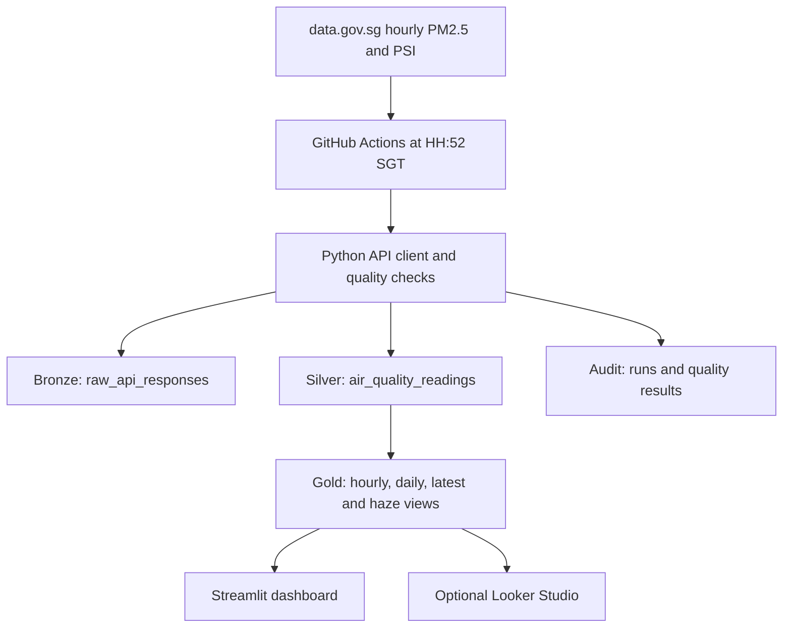

# Architecture and data flow

Every run requests today and yesterday from two APIs. Raw responses append to Bronze. Silver uses `(observed_at, region, metric)` as its primary key. The loader upserts an observation only if the new source publication timestamp is at least as recent as the stored one. Gold is built as PostgreSQL views, so dashboard queries reflect Silver changes without a separate refresh job.

The Python client accesses Supabase over HTTPS. Streamlit uses the anonymous key and read-only policies. The ETL uses the privileged service-role key, stored only in GitHub Actions secrets or a local ignored `.env`. The Looker Studio option uses a dedicated read-only PostgreSQL role.

This architecture suits five regional readings per hourly observation. It shows ingestion, correction handling, data modeling, scheduled orchestration, CI, quality checks and operational observability without requiring Spark for a small dataset.
